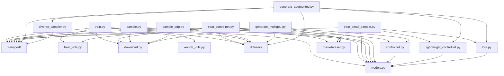

Architecture Overview
=====================

This document describes how core modules depend on each other and how data
flows through training and sampling.

Dependency Graph (Modules)
--------------------------
Mermaid graph of the main Python modules:

Data Flow (Training)
-------------------
- Dataset: images (+ masks/edges) loaded by `maskdataset.py` or `ImageFolder`.
- VAE: images and control inputs are encoded to latents by `diffusers.AutoencoderKL`.
- Transport: `Transport.training_losses` samples path points and computes loss targets.
- Model: SiT or ControlSiT predicts velocity/score/noise depending on configuration.
- Optimization: optimizers update trainable parameters; EMA copies are maintained for sampling.

Data Flow (Sampling)
-------------------
- Sampler: `Sampler.sample_ode` or `Sampler.sample_sde` generates latent trajectories.
- Model: forward or `forward_with_cfg` predicts drift or denoising outputs.
- VAE: decodes final latents back to images.

Notes
-----
- `transport/` is the core for path planning, loss types, and ODE/SDE integration.
- ControlNet variants inject residuals into SiT blocks to condition on masks/edges.
